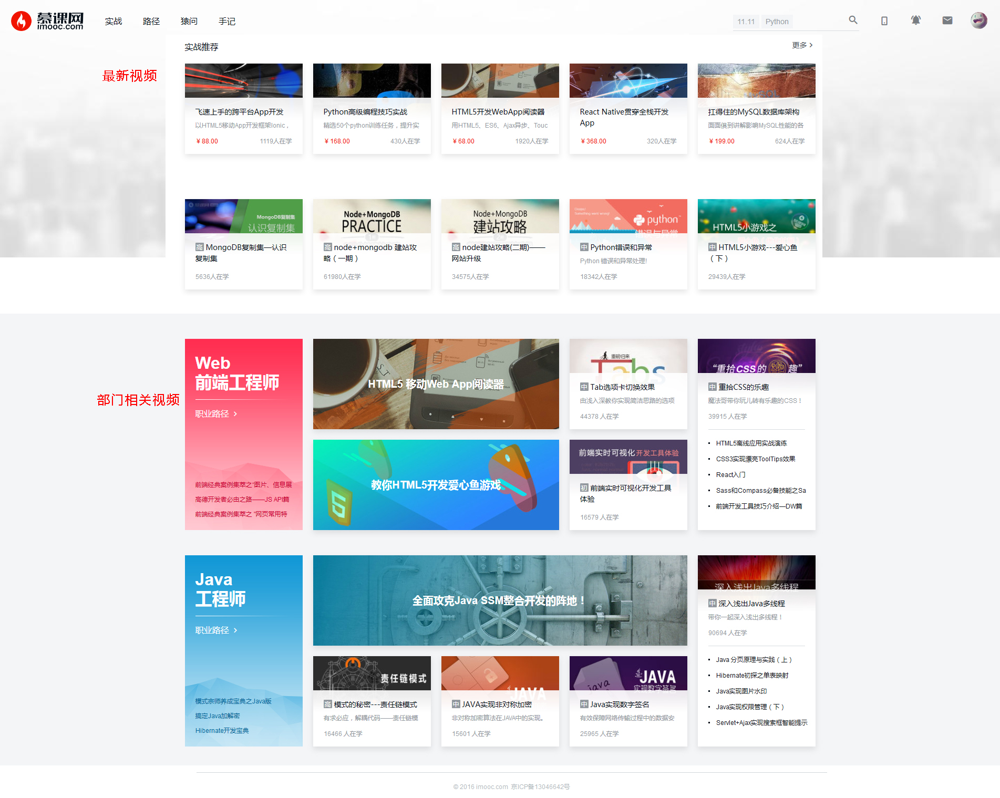

# 规划书

---
### 一、背景
    随着公司部门分享会中的次数越来越多，分享内容多数以视频为主，
    而且分享后，没有形成很好的延续性，使公司内更多的人受益。
    所以，创建一个以每期分享视频为资源的视频收集和分享的网站。

### 二、分析
#### 1、用户群体：
    所有公司人员

#### 2、访问方式：
    PC端

#### 3、实现方式：
    前端：AngularJS（框架）+ {HTML + CSS + JS + JQ}
    后端：Restify（框架）+ NodeJS + MongoDB

#### 4、开发时长：
    2~3周（雏形）

### 三、资源
    土豆、爱奇艺、慕课网、B站

### 四、规划

#### 用户：
    1、登录页
    2、用户中心（列表）：播放历史、视频管理
    3、信息资料设置
    4、上传页

#### 管理员：
    1、登录页
    2、管理员中心
    3、用户列表（添加、修改、删除）
    4、视频列表（审核）

#### ALL：
    1、视频列表
    2、视频播放

### 五、原型图
####<h1>1、all</h1>
<h2 style="text-align: center;">首页</h2>

<h2 style="text-align: center;">登录页</h2>
【采用弹窗方式，该图弹窗内容】

<h2 style="text-align: center;">视频播放页</h2>

####<h1>2、用户</h1>
<h2 style="text-align: center;">用户主页</h2>
观看记录、上传记录

<h2 style="text-align: center;">基本信息页</h2>
昵称、性别、新密码、确认密码

<h2 style="text-align: center;">上传视频页</h2>
视频内容、标题、封面、简介、分类

第一步：先上传视频内容

第二步：编写上传视频信息

####<h1>3、管理员</h1>
<h2 style="text-align: center;">登录页</h2>

<h2 style="text-align: center;">中心页</h2>

<h2 style="text-align: center;">用户列表页</h2>

<h2 style="text-align: center;">用户增加和修改弹窗</h2>
用户名、密码、分类

<h2 style="text-align: center;">视频列表页</h2>

### 六、流程图
####1、用户操作

####2、审核流程

####3、访问视频
